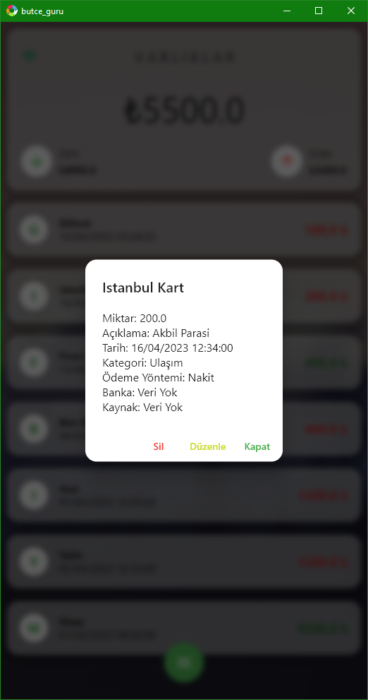

# Bütçe Guru (Bütçe Yönetim Uygulaması)

Bu bir okul projesidir o yuzden okul numarami paylaşıyorum
211216058 - Mehmet Can Kaya

Bu uygulama, kullanıcıların gelir ve giderlerini kolaylıkla takip etmelerine yardımcı olur. Kullanıcılar, ekledikleri gelir ve giderleri kategorilere ayırabilirler (örneğin, yiyecek, giyim, fatura ödemeleri vb.) ve ödeme yöntemlerini belirleyebilirler (örneğin, nakit, kredi kartı, banka kartı vb.). Ayrıca, ödeme tarihlerini ve açıklamalarını da ekleyebilirler.

Uygulama, eklenen gelir ve giderleri otomatik olarak toplar ve sonucu net bütçe olarak gösterir. Bu sayede, kullanıcılar ne kadar para kazandıklarını ve ne kadar harcadıklarını net bir şekilde görebilirler. Ayrıca, geçmiş gelir ve giderlerini de kaydedip yönetebilirler.

### Ana Ekran

### Gelir Ekleme Ekranı

### Gider Ekleme Ekranı

### Gelir veya Gider Detay

### Tarih Seçme Ekranı

### Grafikler

### Internet Bağlantısı Kontrol

### Diğer Ekran Görüntüleri

